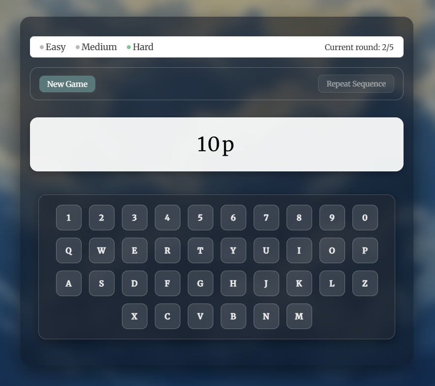

# Simon Says

**Simon says** — Memory Sequence Game. A web-based memory training game built with JavaScript and CSS.  
Players need to memorize and reproduce sequences of numbers and letters, with increasing difficulty and interactive feedback.

## 🌐 Live Demo
* [Netlify](https://q-simon-says.netlify.app/)

## 🖥️ Screenshot

## Features

1. Three difficulty levels:
   - Easy: numbers 0-9  
   - Medium: letters a-z  
   - Hard: numbers + letters
2. Dynamic sequence generation per round  
3. Virtual keyboard for input with clickable keys  
4. Physical keyboard support  
5. Round-based gameplay with up to 5 rounds  
6. Highlighting of correct key presses and sequence display  
7. Audio feedback for round win, game win, error, and loss  
8. Responsive design for desktop and mobile  
9. Adaptive UI: buttons, input, and keyboard scale with screen size  
10. Visual feedback for correct/incorrect input  
11. "Repeat Sequence" and "Next Round" buttons for smooth gameplay  

## Tech Stack

* **JavaScript**
* **CSS**

## Run Locally
1. Clone the repo: git clone https://github.com/SquallerQ/simon-says.git
2. Open index.html in your browser